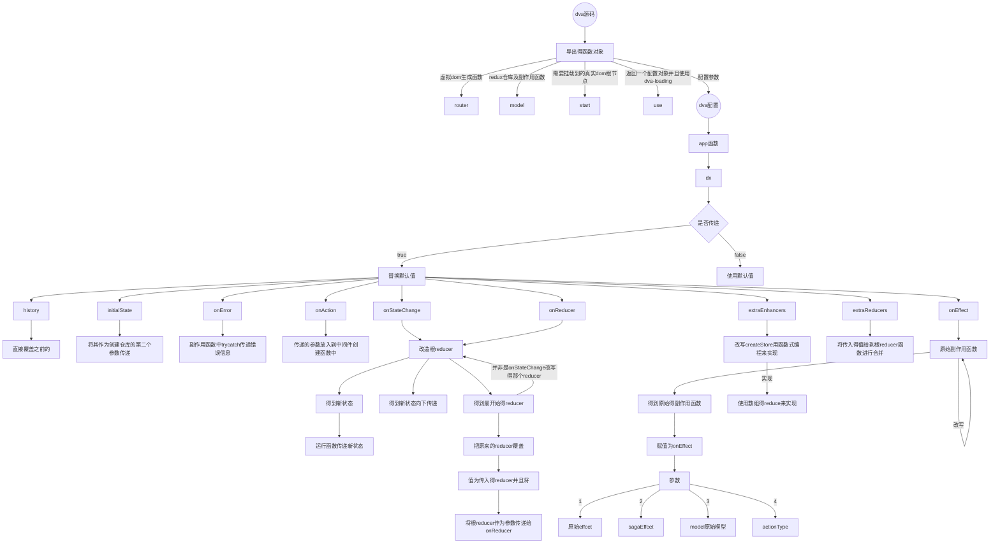

```mermaid
graph TD
zks((dva源码))-->dvafun[导出得函数对象]
dvafun--虚拟dom生成函数-->router
dvafun--redux仓库及副作用函数-->model
dvafun--需要挂载到的真实dom根节点-->start
dvafun--返回一个配置对象并且使用dva-loading-->use
dvafun--配置参数-->ks
ks((dva配置))-->app函数
-->dx-->if{是否传递}
if--true-->mr[替换默认值]
if--false-->mdate[使用默认值]
mr-->history-->直接覆盖之前的
mr-->initialState-->将其作为创建仓库的第二个参数传递
mr-->onError-->副作用函数中trycatch传递错误信息
mr-->onAction-->传递的参数放入到中间件创建函数中
mr-->onStateChange-->gz[改造根reducer]-->得到新状态-->运行函数传递新状态
gz-->得到新状态向下传递
mr-->onReducer-->gz-->dd[得到最开始得reducer]--并非是onStateChange改写得那个reducer-->gz
dd-->把原来的reducer覆盖-->cd[值为传入得reducer并且将]
cd-->将根reducer作为参数传递给onReducer
mr-->onEffect-->ef[原始副作用函数]--改写-->ef-->得到原始得副作用函数-->fz[赋值为onEffect]-->cx[参数]
cx--1-->原始effcet
cx--2-->sagaEffcet
cx--3-->model原始模型
cx--4-->actionType
mr-->extraReducers-->将传入得值给到根reducer函数进行合并
mr-->extraEnhancers-->cgs[改写createStore用函数式编程来实现]--实现-->使用数组得reduce来实现
```